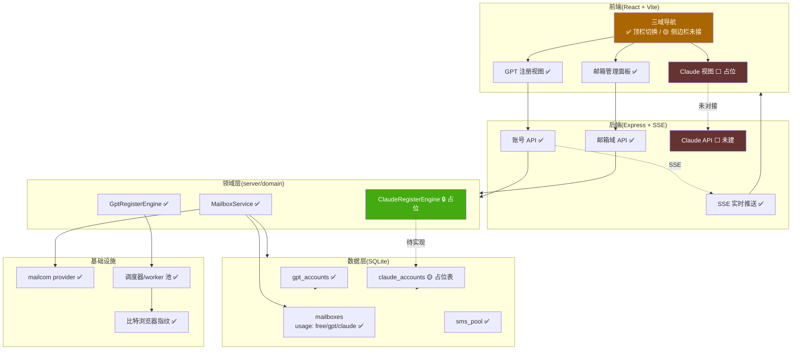
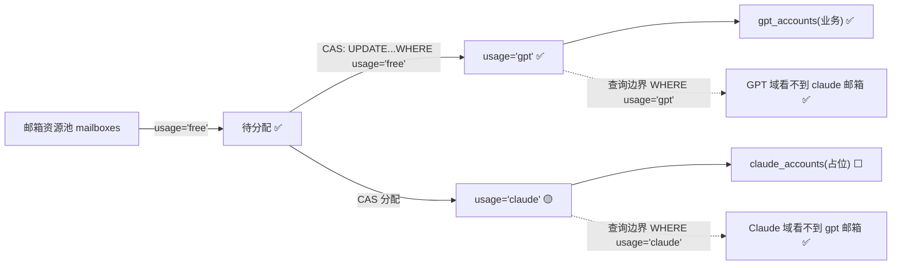

# 项目全景与进度文档

> 系统:ChatGPT/Claude 批量注册控制台(codex_register)
> 架构:从"单业务 GPT 控制台"演进为"邮箱管理 + GPT 注册 + Claude 注册"三域系统
> 更新时间:2026-07-03
> 图例:✅ 已完成/已对接 · 🟡 部分完成/待接线 · ⬜ 未开始/占位 · 🔒 阻塞(依赖外部条件)

---

## 1. 全局状态总览

| 层 | 模块 | 状态 | 说明 |
|---|---|---|---|
| 数据 | mailboxes / gpt_accounts / claude_accounts | ✅ | 三表已建,226 账号已迁移 |
| 数据 | 兼容 DAO 层(JOIN 拼回 accounts 形状) | ✅ | 上层零改动 |
| 后端 | 邮箱域服务 mailbox-service | ✅ | 统一入口 |
| 后端 | 注册引擎抽象 register-engine | ✅ | buildSpawn+onResult+onAbnormalExit;GPT 结果解释已下沉,scheduler 变引擎无关 job runner |
| 后端 | 邮箱域 REST API | ✅ | 导入/分配/改密/删除 |
| 后端 | API 命名对称 `/api/gpt/*`+`/api/claude/*` | ✅ | gpt 中间件透明 alias(排除 mailboxes/claude);claude 列表可用、register 暂 501 |
| 前端 | 三域 tab 切换 + 邮箱/Claude 面板 | ✅ | 2026-07-04 真正接线(此前 domain 声明未用、MailboxPanel 未渲染);顶层 nav + 域门控 + ClaudePanel |
| 前端 | 邮箱校验工具归位 | ✅ | 2026-07-04 从 GPT 控制台迁入邮箱管理域(MailCheckTool.tsx,自包含);free 语义明确为「独立/未归属」 |
| 全栈 | 邮箱能力彻底集中(职责专一化) | ✅ | 2026-07-04 所有邮箱操作(导入/导入后自动改密/多选批量改密/单改密/注册后自动改密开关/校验)集中到邮箱管理;GPT 页移除全部邮箱入口,只做注册 |
| 后端 | 批量改密共享引擎 startBatchPasswd | ✅ | GPT/邮箱域共用(DRY);新增 `/api/mailboxes/batch-change-passwd`(操作 mailboxes 表);导入支持 autoChangePw |
| 前端 | 现代化样式(设计系统 CSS) | 🟡 | CSS 已写,侧边栏结构+暗黑切换未接,未 build |
| 业务 | GPT 注册全流程 | ✅ | 原有能力,未改动 |
| 业务 | Claude 注册 | 🔒 | 依赖注册机制逆向(未知) |

---

## 2. 系统整体架构

---

## 3. 三域隔离机制(核心)

**保证**:邮箱 `usage` 单一归属 + CAS 原子分配 → 物理隔离,不可串。已用 13 项隔离单测验证。

---

## 4. 数据模型

| 表 | 状态 | 关键字段 | 说明 |
|---|---|---|---|
| `mailboxes` | ✅ | id, email, password, **usage(free/gpt/claude)**, provider, grp, pw_status | 邮箱资源池,隔离核心 |
| `gpt_accounts` | ✅ | mailbox_id, status, token, rt_file, plan, phone, batch, *_status | GPT 业务账号 |
| `claude_accounts` | 🟡 | mailbox_id, status, session_key, org_id | 占位表,字段待定稿 |
| `sms_pool` | ✅ | phone, link, bind_count | 接码池(共享) |
| `accounts`(旧) | ✅ | — | 迁移源,只读兜底保留 |
| `logs` | ✅ | account_id | 实时日志 |

**迁移**:✅ 已执行,226 账号 `accounts` → `mailboxes`+`gpt_accounts`,id 对齐;备份 `data/register.db.premigrate-*`。

---

## 5. 后端接口对接状态

| 接口 | 状态 | 前端是否对接 |
|---|---|---|
| `GET /api/accounts` 等账号全套 | ✅ | ✅ |
| `GET /api/mailboxes?usage=` | ✅ | ✅ |
| `POST /api/mailboxes/import`(导入 free) | ✅ | ✅ |
| `POST /api/mailboxes/allocate`(分配 gpt/claude) | ✅ | ✅ |
| `DELETE /api/mailboxes/:id` | ✅ | ✅ |
| `POST /api/mailboxes/:id/change-passwd` | ✅ | ✅ |
| Claude 注册相关 API | ⬜ | ⬜ 未建 |

---

## 6. 文件清单(本次架构重构)

**新增文件**
- `server/domain/mailbox-service.ts` ✅ 邮箱域服务
- `server/domain/register-engine.ts` 🟡 GPT 引擎✅ / Claude 占位🔒
- `web/src/MailboxPanel.tsx` ✅ 邮箱管理面板
- `scripts/verify-migrate.ts` ✅ 迁移测试
- `scripts/verify-p4.ts` ✅ 隔离测试
- `docs/ARCHITECTURE-v2.md` ✅ 架构设计
- `docs/PROJECT-STATUS.md` ✅ 本文档

**修改文件**
- `server/db.ts` ✅ 三表 + 迁移 + 兼容层 + 邮箱池函数
- `server/index.ts` ✅ 邮箱域 API
- `server/scheduler.ts` ✅ 改用引擎 buildSpawn
- `web/src/api.ts` ✅ Mailbox 类型 + 邮箱 API
- `web/src/App.tsx` 🟡 三域切换✅ / 侧边栏+暗黑⬜ 未接
- `web/src/index.css` 🟡 设计系统已写(257行)/ 未 build 生效
- `web/tailwind.config.js` ✅ darkMode:'class'

---

## 7. 分阶段进度

| 阶段 | 状态 | 剩余工作 |
|---|---|---|
| P1-P5 | ✅ | 已完成并测试 |
| UI 现代化 | 🟡 | ①App.tsx 接侧边栏结构 ②加暗黑切换 state ③`npm run build` |
| P6 Claude | 🔒 | 逆向 Claude 注册机制 → 定 claude_accounts 字段 → ClaudeRegisterEngine → Claude API → 前端接线 |

---

## 8. 待办(下一步)

**核心层归一化已完成(2026-07-04)**:scheduler→引擎无关 job runner(Phase A)、API 命名对称(Phase B)、前端三域真正接线。三域骨架完整对称,Claude 机制一到即可填实 `ClaudeRegisterEngine.onResult` + `worker-register-claude.ts` + `/api/claude/register`,job runner/调度/接码/浏览器/SSE 全复用。

剩余:

1. 🔒 **P6 Claude 注册机制**(唯一硬阻塞,外部依赖):逆向 claude.ai 注册流程(邮箱注册?手机验证?反爬?产出 session key / oauth / org id?)→ 定稿 `claude_accounts` 凭证字段 → 实现 `ClaudeRegisterEngine.buildSpawn/onResult` + worker → 接 `/api/claude/register`。**需录制/逆向,如当初 GPT,不能投机实现。**
2. 🟡 **UI 现代化**(可选,非阻塞):侧边栏结构 + 暗黑切换(`.sidebar`/`.main` CSS 已就绪)。
3. 🟡 **YAGNI 暂缓 · 前端共享组件下沉**:GPT 视图的详情抽屉/收件箱/筛选抽成 domain-agnostic,待 Claude 有真实注册产出(第二个消费者形状明确)再抽,避免投机抽象。
